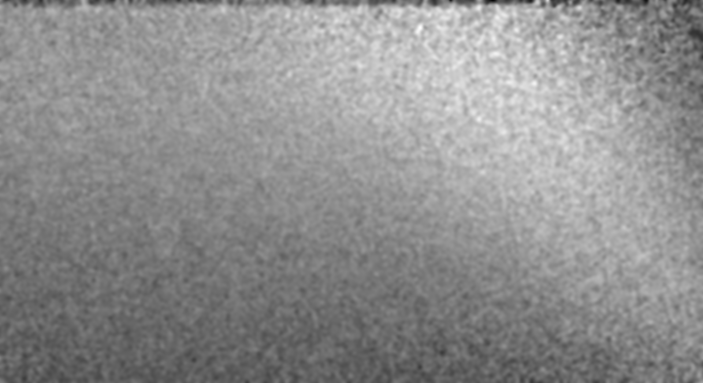
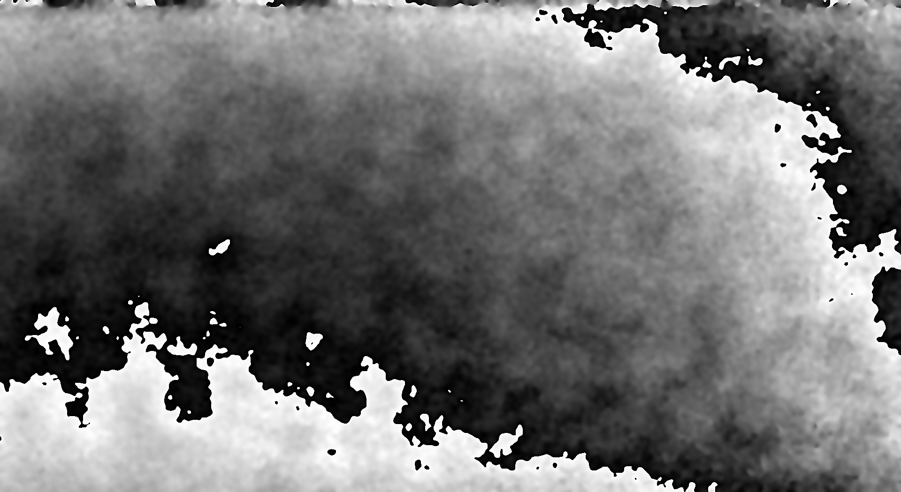
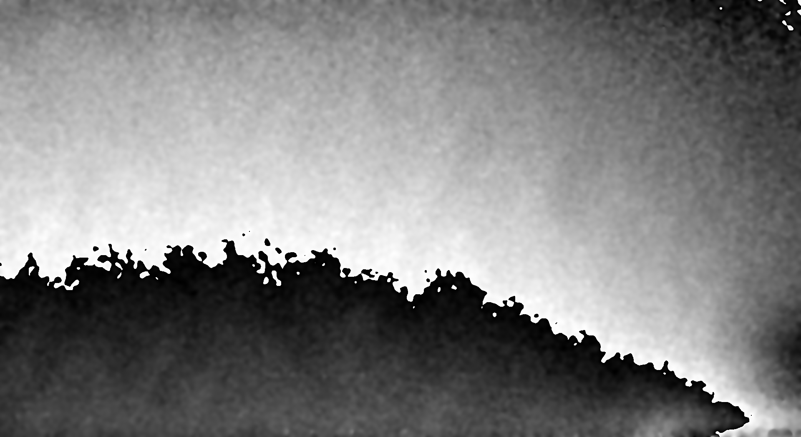
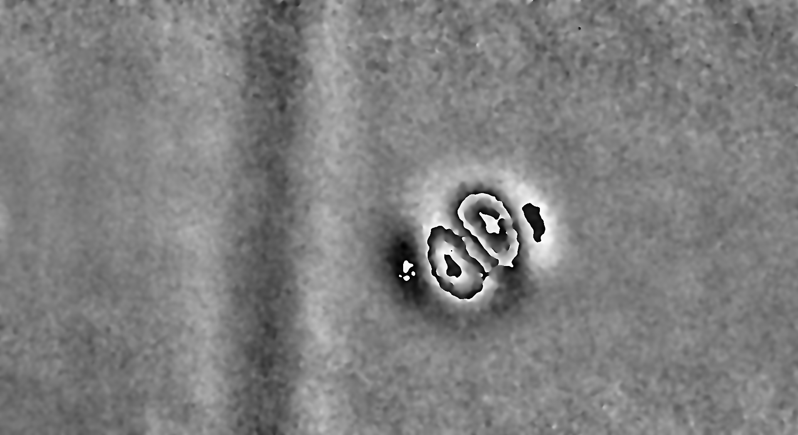
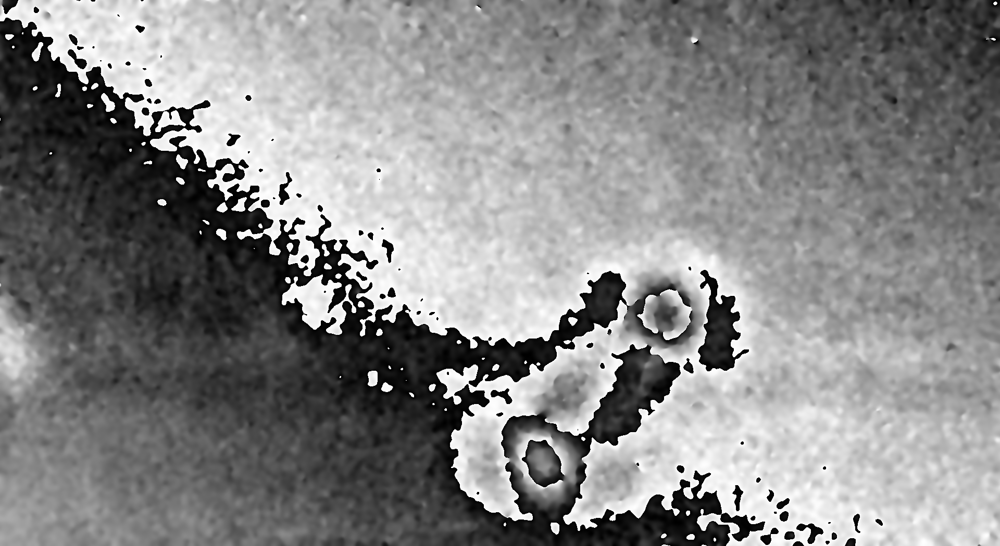
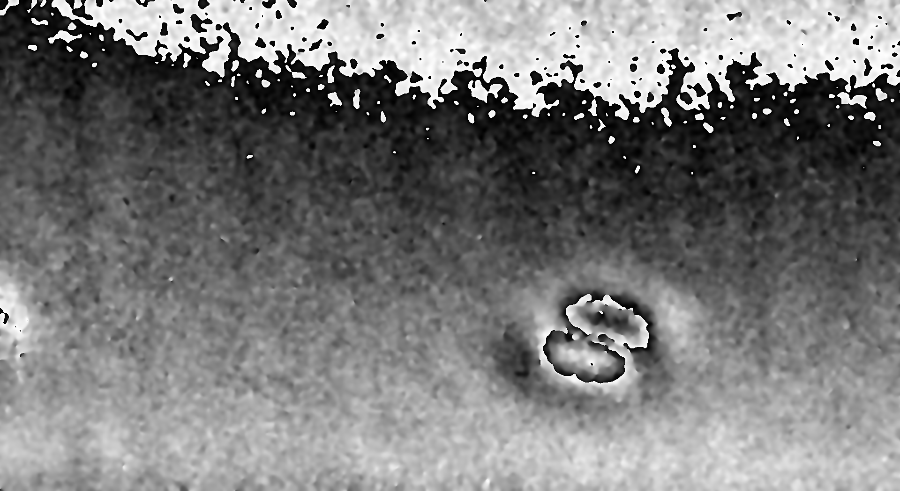
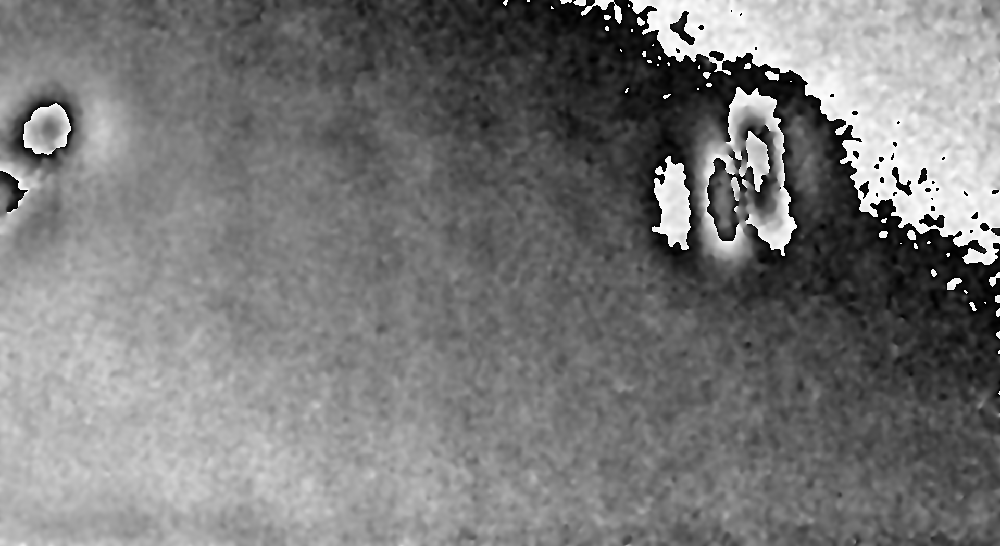

## Example Data Samples

This folder contains representative example images from the shearography dataset, which is intended for multiple research projects and applications related to shearography analysis.  
Please note that these are only small representative examples and **not the full dataset**.

These images provide an overview of the data types and quality used in our studies.

---

## Good Parts for Training (No Stripes)

These images show good parts without phase stripes:

---

## Good Parts for Training (With Stripes)

These images show defect-free parts exhibiting phase stripes, providing variation in the training data.

 

---

## Faulty Parts (No Stripes)

These images depict parts with faults or defects, without phase stripes visible.

---

## Faulty Parts (With Stripes)

These images show defective parts where phase stripes are present.

 

---
